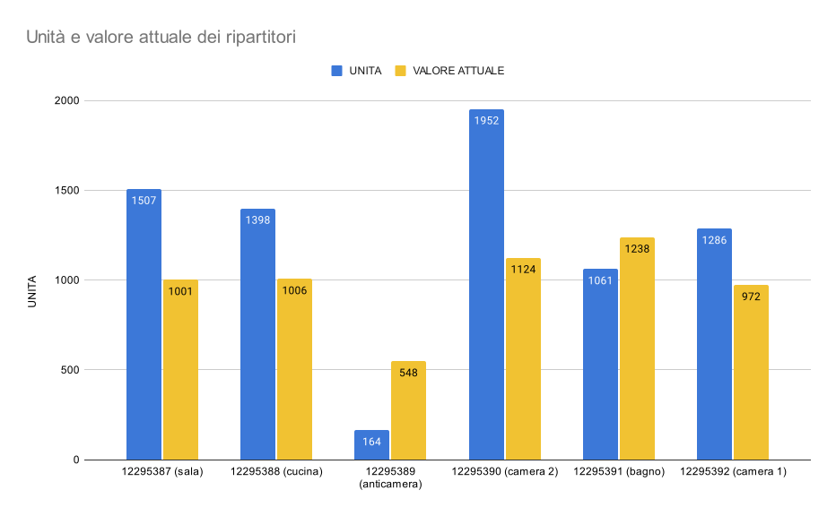

# Lettura contatori riscaldamento

Prima o poi chiunque abiti in un condominio con riscaldamento centralizzato si trova ad avere a che fare con le letture dei ripartitori dei costi del riscaldamento, vuoi per verificare la correttezza delle spese per il riscaldamento o vuoi per semplice curiosità.Questo è anche quello che è capitato a me quando ho ricevuto il prospetto delle ultime spese condominiali da pagare per la stagione invernale.  

Il riscaldamento condominiale si compone sostanzialmente di due parti: una quota fissa e una quota variabile.In questo breve articolo non entrerò nel merito di quella fissa e di come essa venga calcolata dall’amministratore, ma mi limiterò ad alcune brevi riflessioni riguardanti la parte variabile per come risulta dalla lettura dei miei ripartitori, di come leggere i dati e come verificarne la correttezza sulle spese condominiali.

***Ok, vediamo di capirci qualcosa in più!***

## Il ripartitore
Potete ottenere i dati dai vostri ripartitori in due modi.

1.  Andando a leggere le mensilità registrate direttamente sul ripartitore: i ripartitori tengono in memoria di solito dalle 18 alle 36 mensilità che potete recuperare e mettere in tabella.  
Se vi interessa verificare l’andamento del consumo dei singoli caloriferi potete leggere tutte le mensilità, altrimenti vi basterà leggere solo l’ultima misurazione (numero 1) per capire qual’é il consumo totale del calorifero fino all’ultimo mese completo.
2.  Altrimenti potete richiedere all’amministratore la tabella delle rilevazioni effettuate via radio dalla ditta che ha in gestione il riscaldamento del vostro condominio.  

Io personalmente avevo ricevuto dall’amministratore una tabella come questa qui sotto (i ripartitori che ho in casa sono dei Sontex 556 elettronici), e poi sono andato a verificare sui ripartitori i valori dei singoli mesi per verificare correttezza delle informazioni ricevute e per analizzare l’andamento nel tempo del consumo registrato.

| DATA DI LETTURA | INDIRIZZO RADIO | NOMINATIVO | VALORE ATTUALE | Kc x Kq | UNITÀ |
|:---------------:|:---------------:|:----------:|:--------------:|:-------:|:-----:|
|    23/05/2022   |     12295387    |   FRAPOLI  |      1001      |   1,51  |  1507 |
|    23/05/2022   |     12295388    |   FRAPOLI  |      1006      |   1,39  |  1398 |
|    23/05/2022   |     12295389    |   FRAPOLI  |       548      |   0,3   |  164  |
|    23/05/2022   |     12295390    |   FRAPOLI  |      1124      |   1,74  |  1952 |
|    23/05/2022   |     12295391    |   FRAPOLI  |      1238      |   0,86  |  1061 |
|    23/05/2022   |     12295392    |   FRAPOLI  |       972      |   1,32  |  1286 |

**Data di lettura:** ci indica quando è stata fatta l’ultima rilevazione dei ripartitori (quella riportata in tabella) 

**Indirizzo radio**: identifica in modo univoco il singolo ripartitore, così da poterlo associare all’unità abitativa e ad una stanza specifica.  

**Valore attuale**: è la rilevazione che possiamo leggere direttamente sul ripartitore se andiamo a fare la lettura manuale. Riporta la lettura registrata nell’ultimo mese completato (se andiamo a fare la lettura manuale è il mese numero 1, il primo che ci viene presentato)

**Kc x Kq** sono dei coefficienti che la ditta manutentrice utilizza per calcolare l’effettivo consumo dei caloriferi; dipende da vari fattori come materiale in cui è fatto il calorifero, dimensioni.. ecc..

**Unità:** è quel valore che poi viene utilizzato effettivamente dall’amministratore per identificare la quota variabile di riscaldamento di una certa unità abitativa.

## Lettura manuale: frequenze cumulate assolute
Se andiamo a leggere i dati sui ripartitori manualmente partiremo dalla mensilità numero 1 (l’ultima registrata e la più recente), fino ad arrivare alla mensilità di partenza della stagione invernale, in questo caso la mensilità numero 12 (settembre) in cui è stato attivato il riscaldamento e i ripartitori hanno cominciato a registrare.

Come vediamo dalla tabella, i dati che leggiamo non sono le rilevazioni del consumo mensile, bensì le frequenze assolute cumulate di tali rilevazioni: cioè ad ogni mese si sommano le rilevazioni dei mesi precedenti.

In questo modo chi è interessato semplicemente a leggere il consumo totale registrato dal ripartitore non deve leggere lo storico dei mesi ma può limitarsi alla lettura dell'ultimo mese.

|                 |  12 |  11 |  10 |  9  |  8  |  7  |   6  |   5  |   4  |   3  |   2  |   1  |
|-----------------|----:|:---:|:---:|:---:|:---:|:---:|:----:|:----:|:----:|:----:|:----:|:----:|
| INDIRIZZO RADIO | set | ott | nov | dic | gen | feb |  mar |  apr |  mag |  giu |  lug |  ago |
|     12295387    |  9  |  60 | 195 | 395 | 610 | 760 |  913 |  999 | 1001 | 1001 | 1001 | 1001 |
|     12295388    |  11 |  71 | 215 | 417 | 629 | 774 |  923 | 1004 | 1006 | 1006 | 1006 | 1006 |
|     12295389    |  3  |  71 |  79 | 266 | 335 | 417 |  491 |  548 |  548 |  548 |  548 |  548 |
|     12295390    |  1  |  89 | 273 | 523 | 746 | 891 | 1034 | 1122 | 1124 | 1124 | 1124 | 1124 |
|     12295391    |  11 |  88 | 270 | 516 | 774 | 949 | 1133 | 1235 | 1238 | 1238 | 1238 | 1238 |
|     12295392    |  10 |  75 | 243 | 483 | 634 | 789 |  925 |  971 |  972 |  972 |  972 |  972 |

.svg)

## Frequenze assolute
E’ ovviamente molto semplice ricavare la tabella delle frequenze assolute (non cumulate), semplicemente sottraendo dalle mensilità successive il valore dei mesi precedenti.

In questo caso risulta maggiormente evidente quali sono i mesi in cui il calorifero ha consumato e quali no: il valore a settembre è basso perchè il calorifero era spento, viene acceso ad ottobre e smette di funzionare a maggio e giugno, dove le rilevazioni mensili tornano a zero.

|                 |  12 |  11 |  10 |  9  |  8  |  7  |  6  |  5  |  4  |  3  |  2  |  1  |
|-----------------|----:|:---:|:---:|:---:|:---:|:---:|:---:|:---:|:---:|:---:|:---:|:---:|
| INDIRIZZO RADIO | set | ott | nov | dic | gen | feb | mar | apr | mag | giu | lug | ago |
|     12295387    |  9  |  51 | 135 | 200 | 215 | 150 | 153 |  86 |  2  |  0  |  0  |  0  |
|     12295388    |  11 |  60 | 144 | 202 | 212 | 145 | 149 |  81 |  2  |  0  |  0  |  0  |
|     12295389    |  3  |  68 |  8  | 187 |  69 |  82 |  74 |  57 |  0  |  0  |  0  |  0  |
|     12295390    |  1  |  88 | 184 | 250 | 223 | 145 | 143 |  88 |  2  |  0  |  0  |  0  |
|     12295391    |  11 |  77 | 182 | 246 | 258 | 175 | 184 | 102 |  3  |  0  |  0  |  0  |
|     12295392    |  10 |  65 | 168 | 240 | 151 | 155 | 136 |  46 |  1  |  0  |  0  |  0  |

.svg)

## Conclusione
Per concludere possiamo dire che una verifica di questo tipo sui vostri ripartitori non è di solito necessaria, infatti la ditta che ha in gestione l’impianto del vostro condominio utilizza sistemi radio per leggere i ripartitori e i dati che riceve sono quasi sempre corretti.

Può capitare però che riceviate, a seconda delle annate, delle bollette particolarmente salate per la quota variabile del riscaldamento e allora potrebbe interessarvi analizzare quali sono i caloriferi su cui spendete di più.

Potreste accorgervi per esempio di avere un consumo piuttosto alto rispetto agli altri condomini, magari dovuto a caloriferi poco performanti o altre ragioni. Nel mio caso specifico la rilevazione è stata fatta sui vecchi caloriferi in ferro, che quest’anno ho sostituito con nuovi caloriferi in alluminio.

Sarà molto interessante fare la stessa analisi il prossimo anno con i nuovi caloriferi per verificare come la performance sia cambiata. Ovviamente in questo caso ci sarebbero anche altri fattori da prendere in considerazione come le temperature esterne (che variano da inverno ad inverno), ma è meglio non mettere troppa carne al fuoco.

## Nota bene
Bisogna fare attenzione a non confondere il _valore attuale_ del ripartitore con le _unità_, il primo come dicevamo è il valore mensile che leggiamo sul ripartitore, mentre il secondo è quello stesso valore moltiplicato per una serie di coefficienti che descrivono il consumo effettivo del calorifero.

Il _valore attuale_ rappresenta più che altro la performance del calorifero, passatemi il termine, se il valore è alto possiamo dire che il calorifero è andato sempre a bomba, se è basso vuol dire che lo abbiamo tenuto chiuso.

Le _unità_ invece rappresentano il consumo effettivo, infatti a parità di _valore attuale_ due caloriferi di dimensioni diverse hanno una _unità_ differente, perché scaldano in maniera diversa l’ambiente.  

Ai fini della nostra analisi ho utilizzato i _valori attuali_, prima di tutto perché interpretare i coefficienti di riscaldamento non è il mio campo, secondariamente perchè il mio scopo primario era verificare la correttezza dei dati ricevuti dall’amministratore e al contempo farmi un’idea del funzionamento di un sistema di riscaldamento centralizzato.  
Possiamo vedere da questa tabella come ogni ripartitore abbia differenti coefficienti per calcolare le unità di riscaldamento, e quindi come caloriferi con valori simili abbiano un impatto differente sul riscaldamento e quindi anche sulla bolletta a fine mese.

|    INDIRIZZO RADIO    | VALORE ATTUALE | Kc x Kq | UNITÀ |
|:---------------------:|:--------------:|:-------:|:-----:|
|    12295387 (sala)    |      1001      |   1,51  |  1507 |
|   12295388 (cucina)   |      1006      |   1,39  |  1398 |
| 12295389 (anticamera) |       548      |   0,3   |  164  |
|  12295390 (camera 2)  |      1124      |   1,74  |  1952 |
|    12295391 (bagno)   |      1238      |   0,86  |  1061 |
|  12295392 (camera 1)  |       972      |   1,32  |  1286 |

